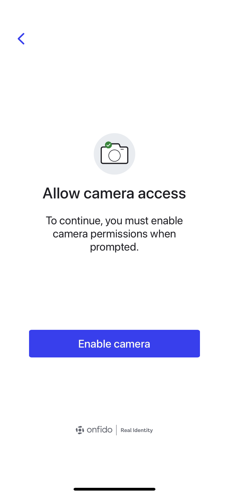
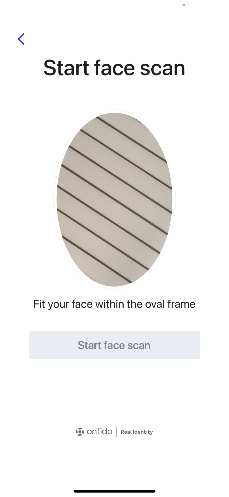
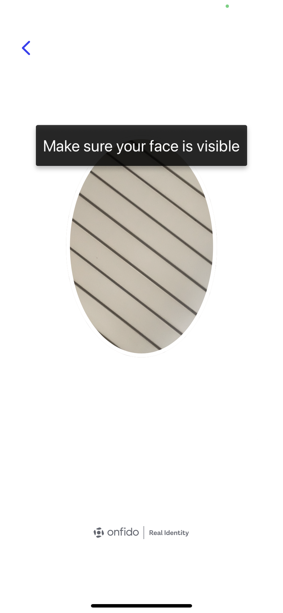
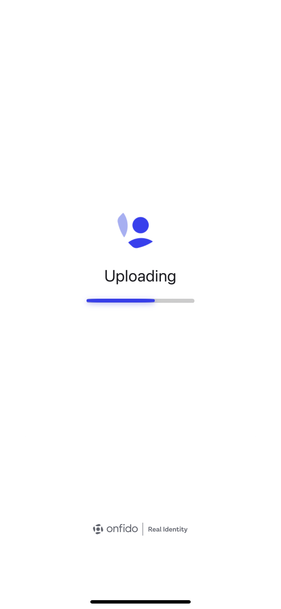
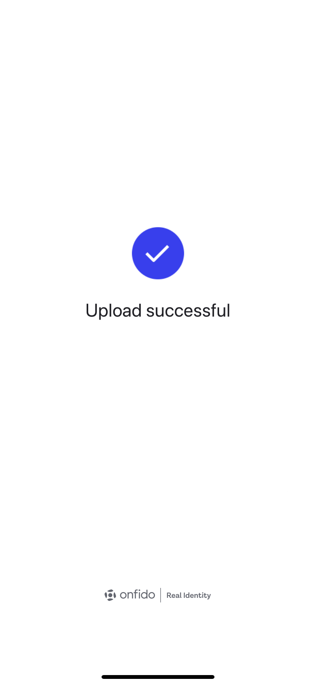
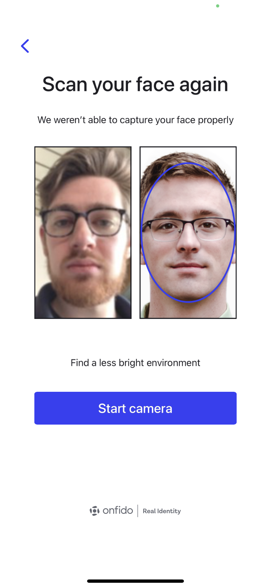
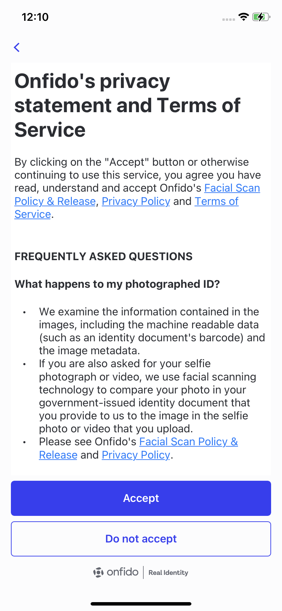

# Onfido iOS Authentication SDK

## Table of contents

* [Overview](#overview)
* [Getting started](#getting-started)
* [Handling callbacks](#handling-callbacks)
* [Customizing the SDK](#customizing-the-sdk)
* [User consent screen](#user-consent-screen)

## Overview

The Onfido iOS Authentication SDK provides a set of screens for iOS applications to capture 3D face scans for the purpose of identity authentication.

<p>
  
  
  
  
  
  
<p>


## Getting Started

The SDK supports iOS 11+.


### 1. Adding the SDK dependency

#### Using CocoaPods

The SDK is available on CocoaPods and you can include it in your project by adding the following to your Podfile:

```ruby
pod 'OnfidoAuth'
```

Run `pod install` to install the SDK.

#### Using Swift Package Manager

The SDK is available with Swift Package Manager and you can include it in your project by adding the following package repository URL:

https://github.com/onfido/onfido-auth-sdk-ios.git

### 2. App permissions

The SDK uses the device's camera. You must have the `NSCameraUsageDescription` key in your application's Info.plist file.

```xml
<key>NSCameraUsageDescription</key>
<string>Required for facial capture</string>
```

### 3. Creating the SDK configuration
Once you have added the SDK as a dependency and you have an applicant ID, you can configure the SDK:

```swift
let config = try! OnfidoAuthConfig.builder()
    .withSDKToken("<YOUR_SDK_TOKEN_HERE>")
    .withRetryCount(2) // Optional, default is 0
    .build()

let flow = OnfidoAuthFlow(withConfiguration: config)
    .with(responseHandler: { response in
        // Callback when flow ends
    })
```

Use `.withRetryCount()` to set the number of repeat attempts a user can do after the first unsuccessful try.

### 4. Starting the flow
Run the flow from the view controller you want the flow to be presented from e.g. `self`, where `self` is a view controller.

```swift
flow.run(from: self)
```

You have now successfully started the flow. Read the next sections to learn how to handle callbacks and customize the SDK.


## Handling callbacks

To receive the response from the flow, pass a callback to the instance of `OnfidoAuthFlow`. Typically, on success, you would create a check on your backend server.

The response object passed to the callback can include the following attributes: `.success(AuthenticationResult)`, `.cancel(CancellationReason)` and `.error(Error)`.

```swift
let responseHandler: (OnfidoAuthResponse) -> Void = { response in
    switch response {
        case .success(let result):
            // User completed flow
            // You can create your check here
        case .cancel(let reason):
            // Flow cancelled by user
            // Reason can be:
            // .deniedConsent -> denied consent on consent screen
            // .openedInLandscape -> face scan in landscape orientation
            // .openedInReversePortrait -> face scan upside down
            // .userExited -> tapped back button on first screen
        case .error(let error):
            // Error occurred
    }
}
```

### Success handling

Success is when the user has reached the end of the flow. `AuthenticationResult` has the `verified`, `uuid` and `token` properties. If authentication was successful, `verified` will be `true` and `token` will be the JWT. There should always be a `uuid`, whether authentication succeeded or failed.

### Error handling

#### Response handler errors

The Error object returned as part of `OnfidoAuthResponse.error(Error)` is of type `OnfidoAuthFlowError`. It is an enum with multiple cases depending on the type of error.

```swift
switch response {
    case .error(let error):
        switch error {
            case OnfidoAuthFlowError.cameraPermissionDenied:
                // User denied permission to use camera
            case OnfidoAuthFlowError.sessionCreationUnsuccessful:
                // Failed to create face scan session
                // Could indicate issue with SDK token
            case OnfidoAuthFlowError.api(let error):
                // Received error from API call
            case OnfidoAuthFlowError.exception(let error):
                // Unexpected error
                // Please contact: ios-sdk@onfido.com
            default:
                // Necessary because Swift
        }
}
```

#### Configuration errors

The following are required when configuring the SDK:

- SDK token

If these are not included, you may encounter the following errors when calling the `build()` method on the `OnfidoAuthConfigBuilder` instance:

- `OnfidoAuthConfigError.missingToken` -> no SDK token or an empty string is provided


## Customizing the SDK

### UI customization

In order to enhance the user experience on the transition between your application and the SDK, you can customize some of the colors and fonts used in the SDK flow. Note that every customization is optional, so if you do not specify a particular customization or set it to `nil`, the default value will be used.

```swift
let appearance = OnfidoAuthAppearance(
    primaryTextColor: <DESIRED_UICOLOR_HERE>,
    …
    buttonCornerRadius: <DESIRED_CGFLOAT_HERE>,
    …
    fontRegular: <DESIRED_FONT_NAME_HERE>,
    …)

let config = try! OnfidoAuthConfig.builder()
    ...
    .withAppearance(appearance)
    ...
    .build()
```

| Color     |    Description    |
| -----|-------|
| `primaryTextColor`     |    Color of most text    |
| `primaryTextDynamicDimmingColor`     |    Color of text in Dynamic Dimming mode<br/><br/>Dynamic Dimming mode is automatically enabled in certain lighting conditions and will include UI differences such as the background turning black    |
| `primaryButtonColor`     |    Background color of buttons    |
| `primaryButtonDynamicDimmingColor`     |    Background color of buttons in Dynamic Dimming mode<br/><br/>Dynamic Dimming mode is automatically enabled in certain lighting conditions and will include UI differences such as the background turning black    |
| `primaryButtonPressedColor`     |    Background color of buttons while being pressed    |
| `primaryButtonDisabledColor`     |    Background color of buttons that are disabled    |
| `primaryButtonDisabledDynamicDimmingColor`     |    Background color of buttons that are disabled in Dynamic Dimming mode<br/><br/>Dynamic Dimming mode is automatically enabled in certain lighting conditions and will include UI differences such as the background turning black    |
| `primaryButtonTextColor`     |    Color of text in buttons    |
| `primaryButtonTextDynamicDimmingColor`     |    Color of text in buttons in Dynamic Dimming mode<br/><br/>Dynamic Dimming mode is automatically enabled in certain lighting conditions and will include UI differences such as the background turning black    |
| `primaryButtonTextPressedColor`     |    Color of text in buttons while being pressed    |
| `primaryButtonTextDisabledColor`     |    Color of text in buttons that are disabled    |
| `primaryButtonTextDisabledDynamicDimmingColor`     |    Color of text in buttons that are disabled in Dynamic Dimming mode<br/><br/>Dynamic Dimming mode is automatically enabled in certain lighting conditions and will include UI differences such as the background turning black    |
| `secondaryButtonPressedColor`     |    Background color of secondary button (currently this is only the “Do not accept” button in the optional consent screen)    |
| `dualSpinnerColor`     |    Color of dual spinner rotating around selfie preview    |
| `retryScreenOvalStrokeColor`     |     Stroke color of oval on ideal selfie image in retry screen   |
| `uploadProgressFillColor`     |    Color of completed portion of upload progress bar    |
| `buttonCornerRadius`     |    Corner radius of buttons (should be set to 40 maximum, otherwise will not work on some buttons)    |
| `fontRegular`     |    Name of font to use on regular text    |
| `fontMedium`     |    Name of font to use on medium text    |
| `fontBold`     |    Name of font to use on bold text    |

### Localization

The SDK comes with out-of-the-box translations for the following locales:

- English (en) 🇬🇧
- Spanish (es) 🇪🇸
- French (fr) 🇫🇷
- German (de) 🇩🇪

### Language customization

The strings used within the SDK can be customized by having a `Localizable.strings` in your app for the desired language and by configuring the flow using the `withCustomLocalization()` method on the configuration builder.

```swift
let config = try! OnfidoAuthConfig.builder()
    ...
    .withCustomLocalization()
    ...
    .build()
```

You can supply partial translations, meaning if you do not include a translation for a particular key our translation will be used instead. You can also name the strings file with the translated keys as you desire, but the name of the file will have to be provided to the SDK as a parameter to the `withCustomLocalization()` method i.e. `withCustomLocalization(andTableName: "MY_CUSTOM_STRINGS_FILE")`. Additionally, you can specify the bundle from which to read the strings file i.e `withCustomLocalization(andTableName: "MY_CUSTOM_STRINGS_FILE", in: myBundle)`.

**Note:**

- If the strings translations change it will result in a MINOR version change, therefore you are responsible for testing your translated layout in case you are using this feature.
- When adding custom translations, please make sure you add the whole set of keys we have in the [example `Localizable.strings` file](https://github.com/onfido/onfido-auth-sdk-ios/tree/main/localization).


## User consent screen
This step contains a screen to collect US end users' privacy consent for Onfido. It contains the required consent language as well as links to Onfido's policies and terms of use. This is an optional screen.

The user must select "Accept" to progress and continue with the flow. The content is available in English only, and is not translatable.

```swift
let config = try! OnfidoAuthConfig.builder()
    ...
    .withUserConsentScreen()
    ...
    .build()
```



:warning: This step does not automatically inform Onfido that the user has given their consent.

If you choose to disable this step, you must incorporate the required consent language and links to Onfido's policies and terms of use into your own application's flow before your US user starts interacting with the Onfido SDK.

For more information about this step, and how to collect user consent for Onfido, please visit [Onfido Privacy Notices and Consent](http://developers.onfido.com/guide/onfido-privacy-notices-and-consent).
